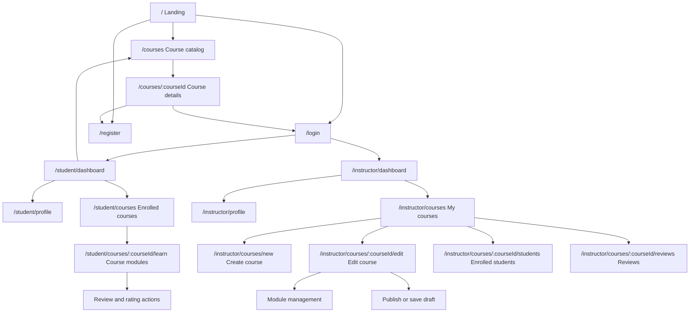

# EduConnect Sitemap

## Route Map

## Public Routes

| Route | Screen | Access |
| --- | --- | --- |
| `/` | Landing page | Guest, student, instructor |
| `/courses` | Published course catalog | Guest, student, instructor |
| `/courses/:courseId` | Published course details | Guest, student, instructor |
| `/login` | Log in | Guest |
| `/register` | Register | Guest |

## Student Routes

| Route | Screen | Access |
| --- | --- | --- |
| `/student/dashboard` | Student dashboard | Student |
| `/student/profile` | Student profile and password | Student |
| `/student/courses` | Enrolled courses | Student |
| `/student/courses/:courseId/learn` | Course module learning view | Student enrolled in course |

Review and rating actions can be placed on the course detail or learning view, but API authorization must still verify the student is enrolled.

## Instructor Routes

| Route | Screen | Access |
| --- | --- | --- |
| `/instructor/dashboard` | Instructor dashboard | Instructor |
| `/instructor/profile` | Instructor profile and password | Instructor |
| `/instructor/courses` | Instructor course list | Instructor |
| `/instructor/courses/new` | Create course | Instructor |
| `/instructor/courses/:courseId/edit` | Edit owned course and modules | Owning instructor |
| `/instructor/courses/:courseId/students` | Enrolled students | Owning instructor |
| `/instructor/courses/:courseId/reviews` | Course reviews | Owning instructor |

## Navigation Rules

- Guests see public navigation only.
- Students see course discovery, enrolled courses, and profile navigation.
- Instructors see course management and profile navigation.
- The frontend may hide inaccessible routes, but the backend must enforce all access rules.

## Future Enhancements

- `/admin` routes for moderation and platform management.
- Payment checkout routes.
- Certificate routes.
