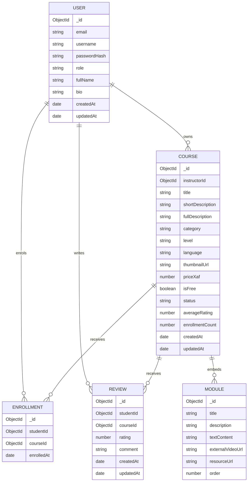

# EduConnect Database Design

## Database

EduConnect uses MongoDB with Mongoose models. The MVP stores users, courses, enrolments, and reviews. Course modules are embedded in the course document to keep module retrieval simple and low-latency for course learning pages.

## Relationship Diagram

## Collections

### users

| Field | Type | Rules |
| --- | --- | --- |
| `email` | string | Required, normalized, unique. |
| `username` | string | Required, normalized, unique. |
| `passwordHash` | string | Required, never returned by API. |
| `role` | string | Required enum: `student`, `instructor`, `admin`. `admin` is reserved. |
| `fullName` | string | Optional profile field. |
| `bio` | string | Optional profile field. |
| `createdAt`, `updatedAt` | date | Managed timestamps. |

### courses

| Field | Type | Rules |
| --- | --- | --- |
| `instructorId` | ObjectId | Required, references owning instructor. |
| `title` | string | Required. |
| `shortDescription` | string | Required. |
| `fullDescription` | string | Required. |
| `category` | string | Required. |
| `level` | string | Required. |
| `language` | string | Required. |
| `thumbnailUrl` | string | Required URL. |
| `priceXaf` | number | Required, minimum `0`. |
| `isFree` | boolean | Required. If true, `priceXaf` must be `0`. |
| `status` | string | Required enum: `draft`, `published`. |
| `modules` | array | Embedded ordered modules. |
| `averageRating` | number | Derived from reviews, default `0`. |
| `enrollmentCount` | number | Derived from enrolments, default `0`. |
| `createdAt`, `updatedAt` | date | Managed timestamps. |

### modules

Modules are embedded inside `courses.modules`.

| Field | Type | Rules |
| --- | --- | --- |
| `title` | string | Required. |
| `description` | string | Optional. |
| `textContent` | string | Optional. |
| `externalVideoUrl` | string | Optional URL. |
| `resourceUrl` | string | Optional URL. |
| `order` | number | Required, used for sorting. |

### enrollments

| Field | Type | Rules |
| --- | --- | --- |
| `studentId` | ObjectId | Required, references a student user. |
| `courseId` | ObjectId | Required, references a published course. |
| `enrolledAt` | date | Required. |

### reviews

| Field | Type | Rules |
| --- | --- | --- |
| `studentId` | ObjectId | Required, references a student user. |
| `courseId` | ObjectId | Required, references a course. |
| `rating` | number | Required integer from `1` to `5`. |
| `comment` | string | Optional review text. |
| `createdAt`, `updatedAt` | date | Managed timestamps. |

## Required Indexes

- `users.email` unique.
- `users.username` unique.
- `courses.instructorId`.
- `courses.status`.
- `courses.category`.
- `courses.level`.
- `courses.language`.
- `enrollments.studentId`.
- `enrollments.courseId`.
- Compound unique index on `enrollments.studentId` and `enrollments.courseId`.
- `reviews.courseId`.
- Compound unique index on `reviews.studentId` and `reviews.courseId`.

## Data Consistency Decisions

- Modules are embedded to simplify reads and avoid extra API calls during learning.
- Enrolments are separate documents to enforce duplicate prevention and support student and instructor views.
- Reviews are separate documents to enforce one review per student per course.
- `averageRating` and `enrollmentCount` are denormalized on courses for fast browsing and must be updated by backend services after review or enrolment changes.

## Future Enhancements

- Separate module collection if module volume grows.
- Payment records.
- Certificate records.
- Admin audit logs.
