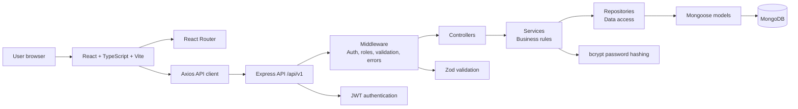

# EduConnect System Architecture

## Overview

EduConnect uses a React frontend and an Express REST API backed by MongoDB. The backend follows the required request flow:

Route -> Middleware -> Controller -> Service -> Repository -> Model

## System Diagram

## Frontend Responsibilities

- Render public, student, and instructor screens.
- Use React Router for route-level navigation.
- Use Axios for API calls to `/api/v1`.
- Use React Hook Form and Zod for client-side form validation.
- Use Tailwind CSS for mobile-first responsive UI.
- Store authentication state without exposing secrets.
- Hide unavailable actions based on authenticated role.
- Show loading, empty, validation, and error states.

Frontend access control improves usability but does not replace backend authorization.

## Backend Responsibilities

- Expose REST endpoints under `/api/v1`.
- Authenticate requests with JWT middleware.
- Hash passwords with bcrypt.
- Validate request input with Zod.
- Enforce role and ownership rules in services.
- Keep business logic out of route files.
- Return consistent JSON responses and correct HTTP status codes.
- Never expose password hashes, JWT secrets, or environment variables.

## Backend Layer Responsibilities

| Layer | Responsibility |
| --- | --- |
| Route | Bind HTTP method and path to middleware and controller. |
| Middleware | Authenticate, authorize, validate input, and handle errors. |
| Controller | Read request data, call services, and shape HTTP responses. |
| Service | Apply business rules, ownership checks, and workflow decisions. |
| Repository | Encapsulate database queries and persistence operations. |
| Model | Define Mongoose schemas, indexes, and database constraints. |

## Cross-Cutting Concerns

- Validation: Zod schemas for request bodies, params, and query strings.
- Authentication: JWT-based access tokens for protected endpoints.
- Authorization: Role checks and resource ownership checks.
- Security: No secrets in responses, no plain-text passwords, safe error messages.
- Performance: Pagination for course lists, lean responses for public browsing, optimized thumbnails.
- Reliability: Clear API error states for unstable networks.

## Deployment Shape

The MVP can be deployed as:

- A static Vite frontend hosted separately.
- A Node.js Express API server.
- A managed MongoDB database.

Environment-specific values must be provided through environment variables and documented in `.env.example`.

## Future Enhancements

- Admin service boundaries.
- Payment provider integration.
- Hosted media storage.
- Background jobs for analytics or notifications.
